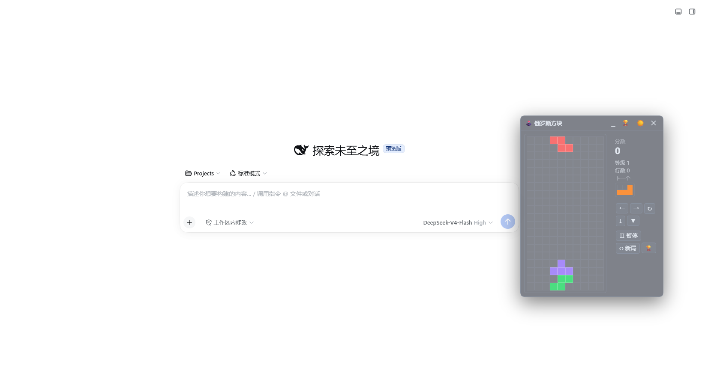

# 🕹️ dsh-floating-tetris — DeepSeek Harness 悬浮俄罗斯方块



在 **DeepSeek Harness Web GUI** 上运行的毛玻璃风格、可拖动的悬浮俄罗斯方块，宿主常驻 Client 插件。**安装一次，Web 会话始终可用**——无需每会话 `cordis_define` / `cordis_run`。

功能：
- ☀️/🌙 深浅色主题切换
- 🏆 最近 10 局排行榜（按分数降序，localStorage 持久化，可清空）
- ▁ / ✕ 收起为标题条（自动暂停）、□ 还原
- 键盘全局操控 + 屏幕按钮双输入

## ✅ 运行环境（版本标识）

| 组件 | 版本 |
|---|---|
| `@deepseek-ai/dsh`（Harness CLI / Web GUI） | **`0.1.2-rc.1`**（开发与实测版本） |
| Web GUI 地址 | `http://127.0.0.1:3080` |
| 宿主接口依赖 | `shell.overlay`、`sidebar.footer.action`、`timer`（`inject: ['timer']`） |
| 插件形态 | **Host-resident Client Plugin**（node 半区空 apply + 浏览器半区 `./client`） |

> ⚠️ `dsh.client` 元数据 + `window.__ModuleLoader__.load` 浏览器产物 + 宿主组合行扫描机制**绑定本版本 harness**。新版本装配前请核对三个插槽名、`timer` 契约与 `dsh-client-modules` 的 roster 扫描约定。

## 🚀 安装（一条命令）

本仓库根目录就是 npm 包，`lib/` 已构建并提交，可直接从 GitHub 安装：

```sh
dsh plugin --profile web add github:LeeGuanWei-a/dsh-floating-tetris
```

等价于在 profile 目录执行 `pnpm add github:LeeGuanWei-a/dsh-floating-tetris`。安装时 `dsh.bundle.patch`（`cordis.patch.yml`）会把插件行自动插入 profile 层叠：

```yaml
# cordis.patch.yml（包内自带，自动应用）
- insert:
    - id: dsh-floating-tetris
      name: 'dsh-floating-tetris'
```

重启 Web 后，悬浮窗随页面出现。

**回滚**：

```sh
dsh plugin --profile web remove dsh-floating-tetris
```

## 📦 仓库结构

```
dsh-floating-tetris/
├── package.json          # npm 包：dsh.bundle.patch + dsh.client 元数据 + exports
├── cordis.patch.yml      # 自注册插件行（安装自动插入 profile）
├── src/                  # 可读源码
│   ├── index.js          # node 半区：空 apply（纯 UI 插件）
│   └── client.js         # 浏览器半区源码：引擎 + UI + inject/apply
├── lib/                  # 已构建产物（提交在仓库，克隆即装）
│   ├── index.js          # node 半区（= src/index.js）
│   └── client.js         # 浏览器半区（ModuleLoader.load 注册形态）
├── scripts/build-lib.mjs # src → lib 构建脚本（改源码后 npm run build）
├── README.md / LICENSE / pic.png
```

`src/client.js` 是唯一的游戏实现源（无 TS、无 JSX、仅依赖 `react`）。修改后：

```sh
npm run build   # 重新生成 lib/，记得一并提交
```

## 🎮 操作方式

| 键盘 | 屏幕按钮 | 操作 |
|---|---|---|
| `←` / `→` | ← → | 左右移动 |
| `↓` | ▼ | 软降（+1/格） |
| `↑` 或 `X` | ↻ | 旋转（带墙踢） |
| `Z` | — | 反向旋转 |
| `空格` | ⤓ | 硬降（+2/格） |
| `P` | Ⅱ | 暂停 / 继续 |

窗口标题栏：`▁`/`✕` 收起为标题条（自动暂停）、`🏆` 排行榜、`☀️/🌙` 深浅色；标题条上 `✕` 才是彻底隐藏（从侧栏或凭窗口状态恢复）。

键盘在悬浮窗打开期间**全局生效**，输入框 / 文本框打字不受干扰。

> 注：`sidebar.footer.action` 入口可能与宿主自带的 `cordis-panel` 同行而显得拥挤；主恢复路径依赖窗口自带收起/还原（收起后仍保留可见标题条）。

## 🏆 排行榜规则

- 每局 Game Over 自动记录 `{ 分数, 消行, 等级, 时间戳 }`；
- 保留最近 10 局，显示按分数从高到低，本局带 `←` 高亮；
- 存储于浏览器 `localStorage`（key `dsh.tetris.records.v1`）；清站点数据 / 无痕 / 换浏览器会丢（界面已注明）；
- 排行榜视图可一键清空（两次点击确认）。

## 🧱 实现要点（供二次开发）

- 棋盘 10×20；7-bag 随机出块；旋转矩阵 + 简单墙踢（偏移 [0,-1,1,-2,2]）；
- 计分：消 1/2/3/4 行 = 100/300/500/800；软降 +1/格、硬降 +2/格；
- 每消 10 行升 1 级，下落间隔 = `max(90, 760 - (level-1)*70)` ms；
- 游戏循环用 `ctx.interval`（timer 服务，`inject: ['timer']`）；
- 渲染前 `normState` 归一化 state，防残缺数据崩溃；
- 窗口为 `position: fixed` 覆盖层（挂 `shell.overlay`），标题栏 pointer-capture 拖拽，边界限制在视口内。

## 📄 许可证

MIT。
